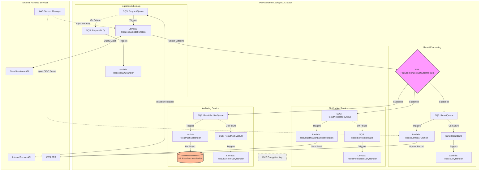

# VME-3793 Enhanced PEP & Sanction Match Notification System - Implementation Plan [DRAFT]

**By Harrison Cove**  
**8 min read**

This initiative aims to overhaul the existing notification process for PEP (Politically Exposed Person) and Sanction screening matches. The current system provides insufficient context for support staff to effectively triage matches, leading to operational inefficiencies and potential risk.

---

## 1. Requirement Analysis

### Understanding & Goal
The current PEP & sanction notification system sends generic alerts that provide insufficient context for the support team, the current “Advanced search” URLs to OpenSanctions trigger API limits, and staff are required to navigate to obvious false positives, the new email would be more intuitive and provide more information and ease of access to support staff, enabling immediate manual resolution by directly linking to the internal VerifiMe Admin Portal.

**Example of the current email:**  
From: Verifime no-reply@verifime.com

To: Verifime Support

CC: N/A

Subject: PEP Sanction Lookup Result Notification

Body:
https://www.opensanctions.org/advancedsearch/?schema=Person&nationality=AU&name=Jason+Falinski&threshold=0.7&dataset=default&birthDate=1970-08-24&algorithm=logic-v2

----------------------------------------
### Current Email Generation Flow
1. `PepSanctionLookupOutcome` contains minimal data (e.g., `id`, `matchFound`, `searchUrl`).
2. A processor converts this outcome into an `EmailNotificationMessage`.
3. `EmailNotificationMessage` currently only contains a single String message field (the email body).
4. `MessageGenerator` builds the SES Message object using:
   - **SubjectGenerator** → Supplies a subject line from configuration (static value).
   - **BodyGenerator** → Generates the email body content (TEXT or HTML).
5. `EmailNotificationMessageProcessor` sends the email using `SesClientWrapper`, which wraps the AWS SES client.

**Problem with Dynamic Search URLs**
- Current emails include an “Advanced Search” URL to OpenSanctions.
- These URLs are dynamic, contain query parameters, and trigger live API searches.
- Each click by support staff triggers a new API request.
- Multiple clicks can cause API limits to be exceeded.

---

### Problems Identified

| Problem                      | Technical Change                                                              | Expected Outcome                                                    |
|-------------------------------|-------------------------------------------------------------------------------|--------------------------------------------------------------------|
| Lack of context in notifications | Include `name`, `confidence`, `entityType`, `country` in `PEPMatchDetails` and email | Support staff can quickly assess match severity                    |
| Operational risk: API limits   | Replace dynamic search URLs with static links using `entityID` and `dataSetID` | Avoid triggering OpenSanctions API, reduce failures               |
| Inefficient workflow           | Include `customerId` in email subject and generate `internalLink`             | Staff can go directly to the customer record in Admin Portal       |
| Outdated email format          | Update `EmailNotificationMessage` and body generators to HTML/structured format | Richer email content, easier to read and act upon                 |
| Incomplete message data        | Enrich outcome from Lambda with full `PEPMatchDetails`                         | All necessary match details are available downstream for emails   |
| Mock/testing gaps              | Update mock data and unit tests to include `customerId` and match details     | Ensure end-to-end testing validates rich email generation         |

---

## Scope and Constraints

**In-Scope:**
- **Email Notifications:** redesign to include structured HTML, confidence scores, entity type, country, and dataset.
- **Enriched Payloads:** convert minimal Match/No Match results into full `PEPMatchDetails` objects.
- **Static Linking:** all external links point to static entity/dataset URLs.
- **Internal Portal Integration:** emails include direct links to the VerifiMe Admin Portal.
- **Archiving:** store full `PEPMatchDetails` for auditing and compliance.
- **Testing & Validation:** unit, component, integration, and acceptance tests for accuracy and client compatibility.

**Out-of-Scope:**
- **OpenSanctions Platform Changes:** no modifications to OpenSanctions endpoints or internal search functionality.
- **Admin Portal UI Redesign:** the internal portal will remain unchanged; only static links will be added in notifications.
- **Automated Decision-Making:** the initiative does not include AI or automated match resolution; manual triage remains the responsibility of support staff.


---

## 2. Technical Approach

### Data Retention
Enhance `pepSanctionLookupResult` Lambda to parse and store relevant match details from the screening instead of discarding it and just supplying the Match/No Match result, we will also archive the PEPMatchDetails used for auditing, just how we are archiving the Match/No Match Boolean at the moment. Something like:

```typescript
type MatchStatus = "Match" | "No Match";

interface PEPMatchDetails {
  matchStatus: MatchStatus;
  name: string;
  confidence: number;
  entityType: string;
  country: string;
  dataSetID: string;
  entityID: string;
  customerId: string;
}

const mockPEPMatches: PEPMatchDetails = {
  matchStatus: "Match",
  name: "John A Doe",
  confidence: 95,
  entityType: "Person",
  country: "US",
  dataSetID: "us_sanctions_2026",
  entityID: "12345",
  customerId: "67890"
};

```
**Key Areas of Codebase to Modify**



In the “Publish Outcome after the Request Lambda Function alter the Match/No Match result sent to PepSanctionLookupOutcomeTopic, instead sending PEPMatchDetails with the customers information imbedded where the "Fan-Out"

pattern allows all subscribers to use the provided PEPMatchDetails, in archiving and the email notification send.

Alter how the information is saved in the archive to accommodate the PEPMatchDetails structure. Then construct the notification using
- const dossierLink = <https://opensanctions.org/entities/${match.entityID}/;>
- const datasetLink = <https://opensanctions.org/datasets/${match.dataSetID}/;
- const internalLink = <https://admin-portal.verifime.com/admin/individual/dashboard/{customerId};>

### Key areas that will need modification

| Key Area                      | File(s)                                                              | Reason / Purpose of Modification                                                    |
|-------------------------------|-------------------------------------------------------------------------------|--------------------------------------------------------------------|
| Outcome / Model Classes | PepSanctionLookupOutcome.java | Needs a customerId field to include in the email subject and internal portal link.|
| Email Message Representation   | EmailNotificationMessage.java | Currently only holds a plain string; must be enriched to hold structured data: match details, static external links, internal portal link, and customerId.               |
| Email Body Generation Utilities           | BodyGenerator.java, MessageGenerator.java             | Must generate rich, structured email content (HTML/text) using customerId, match confidence, country, entity type, and static URLs.       |
| Email Subject Generation          | SubjectGenerator.java | Subject must now include customerId for instant searchability.                 |
| Outcome-to-Email Processing / Notification Services        | PepSanctionOutcomeEmailNotificationProcessor.java, PepSanctionOutcomeEmailNotificationConfiguration.java                         | Orchestrate conversion from PepSanctionLookupOutcome to email; handle enriched message structure, generate internal portal link, ensure subject includes customerId.   |
| Upstream Message Converters / SQS Processing              | SnsTopicSubscriberSqsMessageConverter.java, BasicSqsMessageConverter.java     | Include customerId in outcome when converting SQS messages, so it is available downstream for the email.         |
|Tests and Mocks              | Mock data definitions (e.g., mockPEPMatches), unit tests for email generation     | Mocks must include customerId and other match details to validate rich email generation and internal link functionality.         |

**Safe Linking:**
- Avoid dynamic search URLs that trigger live API calls. 
- Use static URLs derived from the entity ID and dataset ID, and customer ID. 

 

**Static External Linking:**
- The notification email simply embeds the existing link for that entity, so clicking it takes staff directly to the entity’s profile. (e.g., opensanctions.org/entities/{entityID}/).
- In practice it might be something more like, using the example above:

```typescript
const dossierLink = `https://opensanctions.org/entities/${match.entityID}/`;
const datasetLink = `https://opensanctions.org/datasets/${match.dataSetID}/`;
//Rest of the send email process
```

**Internal Call to Action Linking:**
The subject line of the email will only include the Customer ID for instant search, and the email will provide a link directing the staff member to the specific customers' record inside the VerifiMe Admin Portal:

```typescript
const internalLink = `https://admin-portal.verifime.com/admin/individual/dashboard/{customerId}`;
//Rest of the send email process
```

**Email Construction:**
Update the already existing `pepSanctionLookupResultNotification` Lambda to generate HTML emails containing: 

Match data (score, country, entity type,) / Static external links / Direct internal portal link

**Below is an email example template:**

From: Verifime no-reply@verifime.com

To: Verifime Support

CC: N/A

Subject: PEP Sanction Lookup Result Notification

Body:
- https://www.opensanctions.org/advancedsearch/?schema=Person&nationality=AU&name=Jason+Falinski&threshold=0.7&dataset=default&birthDate=1970-08-24&algorithm=logic-v2

| Matched Name | Confidence | Entity Type | Country | Entity Dossier | Source Dataset |
|--------------|------------|-------------|---------|----------------|----------------|
| John A Doe   | 92%        | Person      | US      | [View Entity](dossierLink) | [View Dataset](datasetLink) |

----------------------------------------

# 3. Testing Strategy

## Test Layers (With Goals)

- **Request Lambda** correctly converts OpenSanctions responses into the enriched `PEPMatchDetails` payload.
- **Static links** (entity, dataset, internal portal) are generated exactly as expected and never trigger live search API calls.
- **Email subject and HTML body** render correctly (`subject = PEP | {customerId}`), contain accurate match data, safe links, and are visually readable.
- **End-to-end pipeline** (`SQS → Lambda → SNS → SQS → Notification Lambda → SES → Archive`) works with no message loss and correct archiving.
- **No tests** cause real OpenSanctions API calls (mocks only).
- **System handles edge cases** (missing IDs, multiple matches, malformed data) gracefully.
- **Performance:** system tolerates expected throughput without dead-lettering or API overuse.
- **Security:** no sensitive data leaked in URLs; email HTML is XSS-safe.

---

## A. Unit Tests — Pure logic (fast, deterministic)

**Purpose:** Validate small functions and classes (parsers, link builders, formatters).

**Where to test:**

- `PEPMatchDetails` builder/parsers (Request Lambda)
- URL builders for:
  - `https://opensanctions.org/entities/{entityID}/`
  - `https://opensanctions.org/datasets/{datasetID}/`
  - `${ADMIN_PORTAL_BASE_URL}/admin/individual/dashboard/{customerId}`
- Email subject generator (subject must equal `PEP | {customerId}`)
- HTML fragment generators (table row for a single match)

**Example assertions:**

```typescript
buildEntityLink("abc123") → "https://opensanctions.org/entities/abc123/"
buildInternalLink("0e27...") → "https://admin-portal.verifime.com/admin/individual/dashboard/0e27..."
Mocks: Use small static JSON fixtures (see sample below) instead of network calls.
```

## B. Component Tests — Single Lambda/Processor with HTTP Stubbing

**Purpose:** Verify each Lambda/processor end-to-end in isolation (Request Lambda, Notification Lambda, Archive Lambda).

**Where to test:**

- **Request Lambda:** Given a mocked OpenSanctions JSON, does it produce the enriched outcome?
- **Notification Lambda:** Given an SQS message containing the enriched outcome, does it produce correct SES request payload (subject + message body)?
- **Archive Lambda:** Given the enriched outcome, does it PUT the correct JSON to S3 key `v{version}/{customerId}/{requestId}.json`?

**Assertions:**

- Request Lambda publishes an SNS message whose JSON `matches[0].entityID` matches fixture.
- Notification Lambda calls SES with:
  - **Source:** configured from address
  - **Subject:** `PEP | {customerId}`
  - **Body.Html:** contains CTA button with internal link and table rows for each match
 
## C. Integration Tests — SNS/SQS End-to-End (External APIs Mocked)

**Purpose:** Validate the whole serverless flow inside an isolated environment (no live vendor calls).

**Approach:**

- Use LocalStack or a dedicated test AWS account (isolated) to run:
  - SQS queues
  - SNS topic subscriptions
- Start the Request Lambda with a mocked OpenSanctions response
- Send a real SQS message into `RequestQueue`

**Validate:**

- Enriched message is published to SNS
- Notification SQS receives it
- Notification Lambda consumes and invokes SES mock (or LocalStack SES)
- Archive S3 contains the enriched object

**Assertions:**

- SES send call captured and contains `Message.Body.Html` with expected links

## D. End-to-End & Acceptance Tests (Pre-Prod)

**Purpose:** Test deployed stack end-to-end in a non-prod environment, with all external dependencies real where safe or strongly simulated.

**Approach:**

- Deploy to staging environment with:
  - `ADMIN_PORTAL_BASE_URL` set to staging admin portal
  - OpenSanctions calls stubbed by a stable sandbox/mock endpoint (or limited live queries if permitted)
- Run synthetic end-to-end flows for several scenarios:
  - Single high-confidence match (>90%)
  - Multiple matches (person + company)
  - No matches
  - Missing fields (e.g., missing `datasetID`)

**Validate:**

- Email received by a test mailbox (SES sandbox or decoy inbox) renders correctly in multiple clients (Gmail, Outlook)
- Internal admin link opens staging portal and resolves to the correct record (link format only; authentication can be manual)
- Archive entries present and searchable

**Acceptance Criteria:**

- 100% of synthetic flows produce email with correct subject `PEP | {customerId}` and working links

## E. Email Rendering & Client Compatibility Tests

**Purpose:** Ensure HTML is readable across common email clients and not broken by CSS.

**Approach:**

- Generate the email HTML using mock payloads and validate:
  - Inline CSS and minimal use of unsupported features
  - Link buttons degrade gracefully to anchor links

**Manual checks:**

- Open sample emails in:
  - Gmail (web)
  - Outlook desktop
  - Outlook web
  - Apple Mail (if relevant)
 
## F. Performance & Load Tests (to validate throughput & avoid OpenSanctions overload)

**Purpose:** Ensure application can handle expected volume and that only controlled API traffic occurs.

**Approach:**

- Simulate realistic arrival patterns to `RequestQueue`:
  - **Baseline:** expected average rate (e.g., 200 req/hr)
  - **Burst:** sudden spikes (e.g., 1,000 req within 5 minutes)

**Verify:**

- Request Lambda concurrency behavior and throttling settings
- Backoff/retry/circuit-breaker behavior when OpenSanctions returns 429 or timeouts
- Email sends scale and SES throttling is handled

**Acceptance Criteria:**

- No increase in live OpenSanctions API calls triggered by email clicks
- System processes baseline load with <1% errors; burst handled with retries, messages preserved (no data loss)

# 4. Implementation Steps

## Enrich and Publish the Outcome Payload

**Objective:** Move from a minimal Match/No Match result to a structured `PEPMatchDetails` payload.

**Developer actions:**

- Modify the `pepSanctionLookupResult` Lambda to:
  - Parse full match data from the OpenSanctions response
  - Construct a `PEPMatchDetails` object including:

```typescript
type MatchStatus = "Match" | "No Match";

interface PEPMatchDetails {
  matchStatus: MatchStatus;
  name: string;
  confidence: number;
  entityType: string;
  country: string;
  dataSetID: string;
  entityID: string;
  customerId: string;
}
```
- Replace the existing minimal PepSanctionLookupOutcome payload published to PepSanctionLookupOutcomeTopic with the enriched structure
- Update the archiving service to store the full match object (not just boolean)
- Update SQS/SNS converters and models to reflect the new payload shape

## Refactor Notification Construction (Subject + HTML Body)

**Objective:** Generate actionable, structured email notifications.

**Developer actions:**

- Update `EmailNotificationMessage` to support structured data (not just a single string)
- Modify `PepSanctionOutcomeEmailNotificationProcessor` to:
- Dynamically generate subject:
- 
```typescript
PEP | {customerId}
```
- Construct static links:
```typescript
- https://opensanctions.org/entities/{entityID}/
- https://opensanctions.org/datasets/{dataSetID}/
- https://admin-portal.verifime.com/admin/individual/dashboard/{customerId})
```
- Update `BodyGenerator` / `MessageGenerator` to produce HTML email containing:
    - Match details table
    - Confidence score
    - Country
    - Entity type
    - Static external links
    - Internal Admin Portal CTA link
 
## Update Tests, Mocks, and Validation

**Objective:** Ensure safe rollout and prevent regressions.

**Developer actions:**

- Update mock payloads to include full `PEPMatchDetails` structure
- Add unit tests to validate:
  - Subject contains correct `customerId`
  - Static links are correctly formatted
  - HTML body renders expected match data
- Verify no external API calls are triggered from email links
- Validate archiving still works with new enriched payload
- Deploy to test environment and perform end-to-end validation through SNS → SQS → Email → Archive
